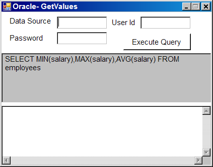
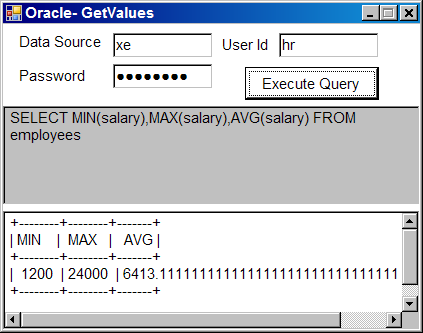

# Oracle Recipe #3: How to Execute a query that returns a Single Row with the method GetOracleValues

if you want to obtain multiple values from a database, you can call the executeReader method once on a OracleCommand object, to execute a SQL statement that returns a collection of values in a single row result.

The ExecuteReader method returns an instance of a class that implements the IDataReader interface. Each of the data reader classes provided by .NET Framework has a GetValues method, which returns an array of column values for the current row.

To obtain a single row from a database.
<ol>
<li>Open a OracleConnection.</li>
<li>Create and initialize a OracleCommand object.</li>
<li>Call the ExecuteReader method on the command object. Assign the return value from this method to a data reader variable.</li>
<li>Call the Read method on the data reader object to move to the first(and only) row in the result set.</li>
<li>Call the GetOracleValues method on the data reader object. Pass an object array as a parameter to retrieve the scalar results of the query.</li>
<li>Convert each element in the array to an appropriate data type, if necessary.</li>
<li>Close the OracleDataReader object.</li>
<li>Dispose the OracleCommand object.</li>
<li>Close the database connection.</li>
</ol>
The following example shows how to execute a query that returns a set of values. The example place the results into an array named results.

<b>Fig 1. Running the example.</b>

<b>Fig 2. Entering the data for the connection string.</b>

<b>Fig 3. Executing the query and getting the output.</b>

This program uses the HR samples from Oracle :
<a href="https://github.com/oracle-samples/db-sample-schemas">Oracle db samples</a>

